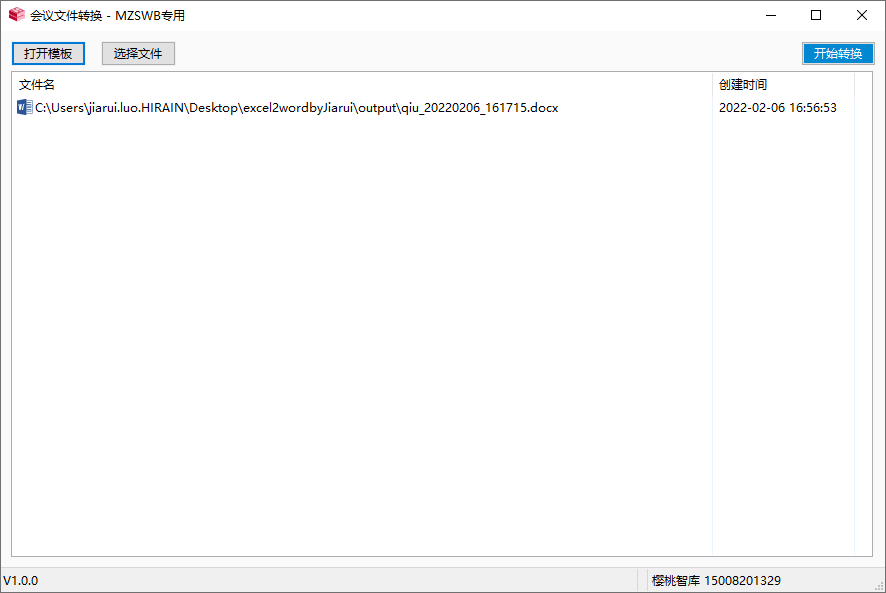

**<p align="center">会议文件转换Excel To Word</p>**


## 项目简介




经常会有将Excel文档中的信息提取并放到Word文档中的需求。


本项目受[excel_to_word](https://github.com/star1986xk/excel_to_word) 的启发。原作者将表格中的成绩提取，并重整后放置到word文档中。


在本项目中，实现的功能是将会议的信息，从Excel文档中提取以后，再写入到Word文档中，并且加上了可视化的操作界面。
界面中具有查看模板功能，导出结果列表页展示功能，选中Excel文档以后一键转换功能。

## 项目文件树

```shell
├── excel2wordByJiarui.py
├── gui_run.py
├── output
│   └── qiu_20220206_183015.docx
├── requirements.txt
├── resources
│   ├── ...
│   └── img.png
├── screenshot.png
├── tmp
│   └── template.docx
├── utils.py

```
其中`excel2wordByJiarui.py`是将excel转换为word的核心代码，其中包含测试方法，可以进行测试。

## 使用方法 

0、准备运行环境
在mac下编写，在windows10系统下打包程序。

1、拉取代码
```shell
git clone https://github.com/Jarrettluo/excel2wordbyJiarui.git
```
2、安装依赖
推荐使用镜像源安装，让安装速度更加迅速。
```shell
pip install -r requirements.txt -i https://pypi.douban.com/simple
```

3、运行程序
```shell
python run gui_run.py
```
在文件树的`resources`文件夹中具有测试文件，可以进行程序校验。

#### 其他方法

可以在中直接下载打包完毕的程序
[https://github.com/Jarrettluo/excel2wordbyJiarui/releases](https://github.com/Jarrettluo/excel2wordbyJiarui/releases)


## pyinstaller 打包方法

```
pyinstaller -F -w gui-2.py -i ./resources/switch_128.ico
```
-F ：选中某个文件


-w ：显示窗体


-i ： 使用图标


## 许可信息

遵从MIT协议。

## 联系方式

Jarrett Luo - [jiaruiblog.com](http://jiaruiblog.com) - luojiarui2@163.com
